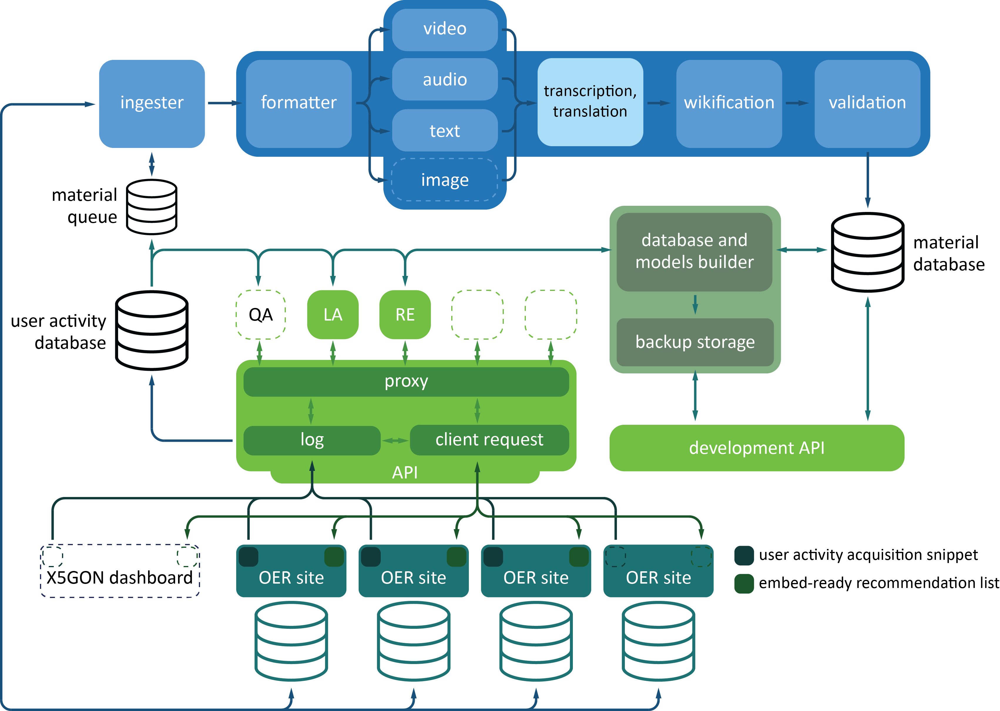

# X5GON Platform API

![Node][programming-language]
![Node.js CI][github-action]
[![Linux Build][linux-build]][linux-build-status]
[![OSX Build][osx-build]][osx-build-status]
[![License][license]][license-link]


The X5GON project stands for easily implemented freely available innovative technology elements that
will converge currently scattered Open Educational Resources (OER) available in various modalities
across Europe and the globe.



This repository contains the technology that will realize the vision set within the X5GON project.
All of the source code is found in the `src` folder. The folder is structured such that files with
similar roles or functionalities are found in subfolders making it easier to navigate through the
project.

The repositories contains the following components:

- **Platform baseline.** Sets up the service which connects all other
  components. Link: [src/services/platform](./src/services/platform)
- **Recommender engine.** The service providing material and user
  recommendations. Link: [src/services/recsys](./src/services/recsys)
- **Material processing pipeline.** A service for retrieving and processing
  OER materials. Link: [src/services/preproc](./src/services/preproc)

## Prerequisites

- Create `.env` file in the `src/config` folder. See instructions described in this [readme](./src/config/README.md).

- node.js v6.0 and npm 5.3 or higher

    To test that your node.js version is correct, run `node --version` and `npm --version`.

- postgres 9.6 or higher

    Execute the following commands to initialize the `x5gon` database
    ```bash
    createdb x5gon
    cd src/load && node -e "require('./create-postgres-database').startDBCreate();"
    ```

- docker v18 or higher, docker-compose v1.23 or higher

    To initialize KAFKA using docker execute the following commands
    ```bash
    cd docker && sudo IP="machine-network-id" docker-compose up -d
    ```
    To check if the kafka service has been successfully initialized, run the following command:
    ```bash
    sudo docker ps
    # should return something similar to this
    CONTAINER ID  IMAGE                   COMMAND                    CREATED      STATUS      PORTS                                               NAMES
    591cf7e8e0fb  wurstmeister/kafka      "start-kafka.sh"           2 hours ago  Up 2 hours  0.0.0.0:9092->9092/tcp                              docker_kafka_1
    ef8613361a00  wurstmeister/zookeeper  "/bin/sh -c '/usr/sb...'"  2 hours ago  Up 2 hours  22/tcp, 2888/tcp, 3888/tcp, 0.0.0.0:2181->2181/tcp  docker_zookeeper_1
    ```

## Install

To install the project run

```bash
npm install
```

## Run Components

Before you run any of the components you must first create an `.env` file containing the process
environments. For more detail see [README](./env/README.md).

### Component Initialization

Running the components can be done by using the node process manager `pm2`. To install it run

```bash
npm install -g pm2
```

#### Platform Component

To start the platform run the following command:

```bash
npm run start:platform
# or with node process manager
pm2 start ecosystem.platform.config.json
```

#### Recommender Engine Component

Before starting the recommender engine component, first build the recommender models

To start the recommender engine component run the following command:

```bash
npm run start:recsys
# or with node process manager
pm2 start ecosystem.recsys.config.json
```

[programming-language]: https://img.shields.io/badge/node-%3E%3D%2010.0.0-green.svg
[github-action]: https://github.com/X5GON/platform-api/workflows/Node.js%20CI/badge.svg
[linux-build]: https://img.shields.io/travis/X5GON/platform-api/master.svg?label=linux
[linux-build-status]: https://travis-ci.com/X5GON/platform-api
[osx-build]: https://img.shields.io/travis/X5GON/platform-api/master.svg?label=mac
[osx-build-status]: https://travis-ci.com/X5GON/platform-api
[license]: https://img.shields.io/badge/License-BSD%202--Clause-green.svg
[license-link]: https://opensource.org/licenses/BSD-2-Clause
