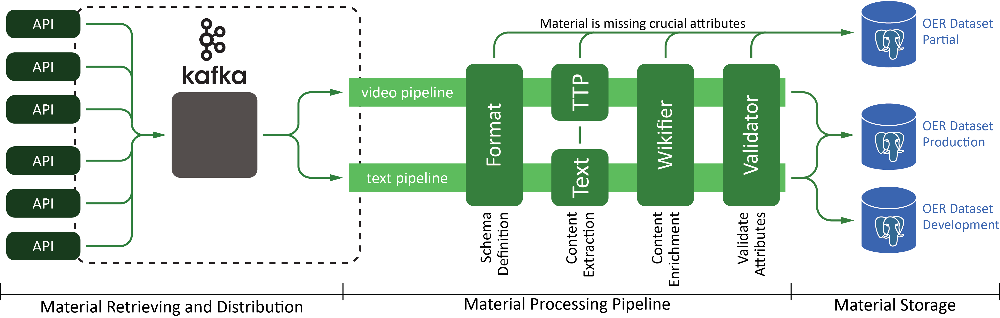

# OER Processing Pipeline

This folder contains the code base for OER material processing pipeline. The
pipeline is created using qtopology which is a distributed stream processing layer.

## Prerequisites

### Apache Kafka and Docker

The material processing pipeline is dependent on Apache Kafka. One can install
an instance of Apache Kafka on their machine - what we prefer is to use a docker
container which includes Apache Kafka.

#### Running Docker on Linux

In the command line run the following commands. This will install and link Docker
to your account.

```bash
sudo apt-get update
sudo apt-get -y install docker.io
sudo ln -sf /usr/bin/docker.io /usr/local/bin/docker
```

Docker Hub contains a container called
[eriknovak/kafka-x5gon](https://hub.docker.com/r/eriknovak/kafka-x5gon)
which includes Apache Kafka adapted for the X5GON platform. Running the following
command should start a docker container (in dettach mode `[-d]`).

**NOTE:** It is required to run the Kafka container before starting the pipeline.

```bash
sudo docker run -p 2181:2181 -p 9092:9092 -d --env ADVERTISED_HOST=localhost --env ADVERTISED_PORT=9092 --restart unless-stopped --name kafka-x5gon -h kafka-x5gon eriknovak/kafka-x5gon
```

## Folder Structure

The folder structure is as follows:

| folder name | description |
| ----------- | ----------- |
| pipelines   | Contains components and scripts for running a particular processing pipeline |
| retrievers  | Contains different OER material retrievers as well as the basic retriever used as an example |

## Processing Pipelines

The processing pipelines accept Open Educational Materials of a particular *type* nad process it accordingly. The two types that are currently supported are:

- text
- video/audio

Figure 1 shows the material processing pipeline architecture.


<p style="text-align:center;"><i>Figure 1:</i> The material processing pipeline architecture. It shows how we acquire materials via different APIs and send it to the appropriate pipeline based on the material's type.</p>


Each pipeline contains the following components:

- **Format.** Formats the acquired materials into a common schema.
- **Content Extraction.** Extracts the content from the material. This is done based on the material type:
    - **Text.** We use *textract*, a Nodejs library that is able to extract raw text from the text material.
    - **Video/Audio.** We use the *Transcription and Translation Platform* (TTP) which automatically generates
        transcriptions (subtitles) and translates the video content.

- **Content Enrichment.** Enriches the content by extracting additional features from the material.
    - **Wikification.** We use *wikifier*, an online service for extracting wikipedia concepts associated with      the provided text.
    - **DMOZ Classification (TODO).** We still need to develop the DMOZ classification model to acquire the         different topics the material is associated with.

- **Validation.** Validates if the material object contains all of the required values.

- **Material Storing.** Stores the material in the appropriate database. If there were any errors during this
    process, we store the error and the material in a different table for future exploration.

Components of the pipeline are stored in the [pipelines](pipelines/) folder.

## Retrievers

The retrievers are responsible for retrieving materials from OER providers that are registered in the
X5GON Network. For each provider we need to develop its own retriever, custom for their API.

The currenlty available retrievers are for the following OER providers:

- [Videolectures.NET](http://videolectures.net/)


